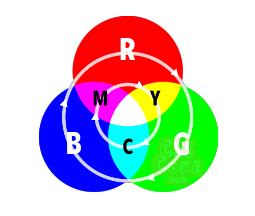
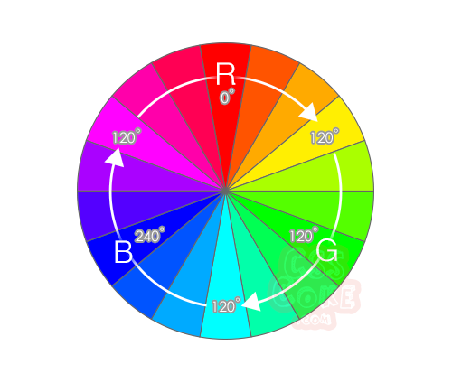
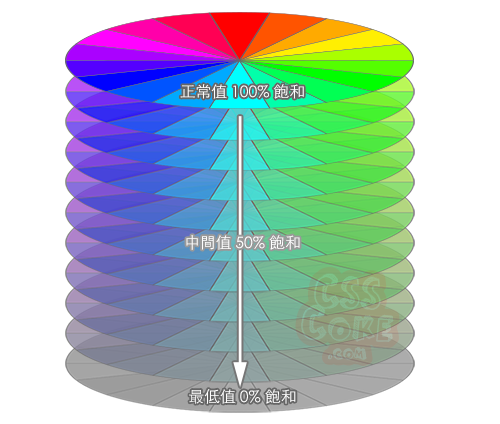
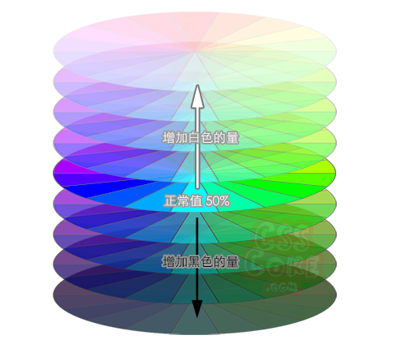

# HTML Guide  

[Javascript example](./js_example.md)  
[Css example](./css_example.md)  
[Tag](#tag)  
[css](#css)  
[Javascript](#javascript)  
[Other](#other)  
[Reference link](#ref_link)  

<a id="tag"></a>
## Tag  [[Home]](#)  
```html
<!-- ... --> : 註解
<h1></h1>~<h6></h6>
<p></p>
<a href=""></a>


figure :代表一段獨立的内容(是圖像，插圖，圖表，代碼片段等)
figcaption : 說明
<figure>
	
	<figcaption>
	花...
	</figcaption>
</figure>

<ul> : unorder list
	<li>清單</li>
	<li>清單</li>
</ul>

<ol> : order list
	<li>步驟一</li>
	<li>步驟二</li>
</ol>

<nav> : 導覽頁
	<a href="">選單</a>
	<a href="">選單</a>
	<a href="">選單</a>
</nav>

// table 
<table border='2'>
	<tr>
		<td>data</td>
		<td>data</td>
		<td>data</td>
		<td>data</td>
		<td>data</td>
	</tr>
	<tr>
		<td>data</td>
		<td>data</td>
		<td>data</td>
		<td>data</td>
		<td>data</td>
	</tr>
		<td>data</td>
		<td>data</td>
		<td>data</td>
		<td>data</td>
		<td>data</td>
	<tr>
	</tr>
</table>

<strong></strong> : 強調(粗體)
<em></em> : 強調(斜體)
<b></b> : 粗體
<i></i> : 斜體
<style> : html set ccs
	......
</style>
```

<a id="css"></a>
## css  [[Home]](#)  
階層式樣式表(Cascading Style Sheets)  
*	in HTML  
```html
<!DOCTYPE html>
<html lang="en">
<head>
	....
	<style>
		p {
			color: red;
			background: gray;
			font-size: 20px;
		}
	</style>
</head>
<body>
	....
</body>
</html>
```

* 註解  
```
/* .... */ 
```

* type 
```html
tag {

}
.class {

}
```


<a id="javascript"></a>
## Javascript  [[Home]](#)  

* debug  
	* console.log  
	```js
	console.log("myFunction")
	```

* Web APIs 
	* windows  
	```js
	// 頁面跳轉
	var usr = '/' + id + '/' + user_pass;
	window.location = usr;
	```

<a id="other"></a>
## Other[[Home]](#)  
* lorem  
```html
lorem
```

* color  
	* RGB color  
	RGB色彩在網頁設計時的標記方式是 RGB(0-255 , 0-255, 0-255)，其中括弧內以逗號分隔的三組數值恰好就是 (R, G, B) 的色彩數值  
	RGB色彩以R在上方順時針排列，而中間產出的混合色採則是我們印表機的C、M、Y(藍、洋紅、黃)三色
	

	* HSL color  
	HSL(Hue, Saturation, Lightness)色彩寫法，HSL色彩的寫法是 HSL(色相角度但不加單位0-360, 色彩飽和度0-100%, 色彩亮度0-100%)，而在括號內的色相採用的是0-360度，正常所見的語法就像是這樣  
		* 色相 （Hue）  
		色相的0度為R(紅)色，120度為G（綠）色，240度為B（藍）  
		
		* 飽和度（Saturation）- 鮮豔   
		
		* 亮度/明度（Lightness）  
		

	* 調整  
	需要先將原色設定出來，接著再利用第三色來調整亮度，這樣就搞定了！那若是我們想要調暗的話，那就是把原本的兩個色彩數值降低(也就是光線強度開若一點的概念)，這樣就你就可以把顏色設定出來囉  

* SEO:搜尋引擎最佳化  
搜尋引擎優化 (SEO) : 透過自然排序（無付費）的方式增加網頁能見度的行銷規律。SEO包含技術與創意，用以提高網頁排名、流量，以及增加網頁在搜尋引擎的曝光度。  

* attribute(屬性) 
```html
src : attribute

style : set attribute  
<p style="color:red;">...</p>
```

* 名詞  
	* inline style  
	```html
	<p style="color:red;">...</p>
	```


<a id="ref_link"></a>
## Reference link  [[Home]](#)  
* [w3schools](https://www.w3schools.com/)  
* [MDN](https://developer.mozilla.org/zh-TW/)  
* [W3C](https://www.w3.org/)  
* [CODEPEN](https://codepen.io/)  
* [網頁色彩碼](http://csscoke.com/2015/01/01/rgb-hsl-hex/)  
* [假圖 Fake images please](https://fakeimg.pl/)  
